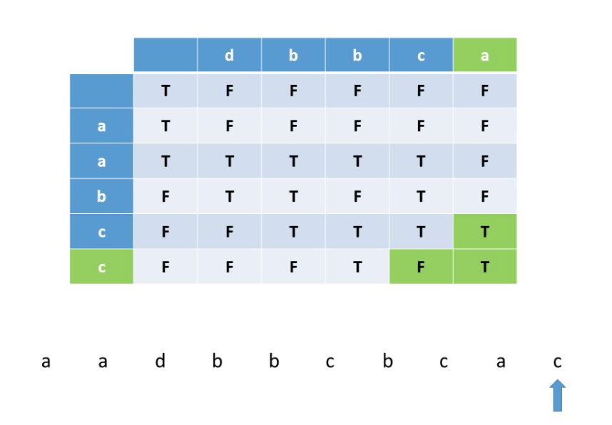

# Interleaving String


### Basic Idea

这道题目其实就是看s1 s2 两个字符串在不改变各自内部顺序的情况下交叉在一起能不能形成s3。仔细观察的话就会发现当我们固定好s1和s2中的两个index i j 的时候，只要我们确定 `s1[0:i]`和 `s2[0:j]` 能够通过交叉形成 `s3[0:i+j]` , 那么在这之后的部分就变成了和整个问题一样的子问题，于是我们就可以使用DP的思路来解决，而 i j 就可以唯一地表示一个子问题。

这道题我们可以使用DFS with cache和DP两个解法来做，时间复杂度 O\(MN\)，通过优化DP也可以做到`O(min{M,N})` 的时间。

### Java Code

DFS 解法

```java
class Solution {
    Boolean[][] cache;
    int M, N;
    String s1, s2, s3;
    
    public boolean isInterleave(String s1, String s2, String s3) {
        if (s1.length() + s2.length() != s3.length()) {
            return false;
        }
        M = s1.length();
        N = s2.length();
        this.s1 = s1;
        this.s2 = s2;
        this.s3 = s3;
        cache = new Boolean[M + 1][N + 1];
        return dfs(0, 0);
    }
    
    private boolean dfs(int m, int n) {
        if (m == s1.length() && n == s2.length()) {
            return true;
        }
        if (cache[m][n] != null) {
            return cache[m][n];
        }
        boolean ret = false;
        for (int i = m; i < s1.length(); ++i) {
            if (s1.charAt(i) != s3.charAt(n + i)) {
                break;
            }
            ret |= dfs(i + 1, n);
        }
        for (int i = n; i < s2.length(); ++i) {
            if (s2.charAt(i) != s3.charAt(m + i)) {
                break;
            }
            ret |= dfs(m, i + 1);
        }
        cache[m][n] = ret;
        return ret;
    }
}
```

DP 解法



```java
class Solution {
    public boolean isInterleave(String s1, String s2, String s3) {
        int M = s1.length(), N = s2.length();
        if (M + N != s3.length()) {
            return false;
        }
        boolean[][] dp = new boolean[M + 1][N + 1];
        for (int i = 0; i < dp.length; ++i) {
            for (int j = 0; j < dp[0].length; ++j) {
                if (i == 0 && j == 0) {
                    dp[i][j] = true;
                }
                if (i > 0 && dp[i - 1][j]
                    && s1.charAt(i - 1) == s3.charAt(i + j - 1)) {
                    dp[i][j] = true;
                }
                if (j > 0 && dp[i][j - 1]
                   && s2.charAt(j - 1) == s3.charAt(i + j - 1)) {
                    dp[i][j] = true;
                }
                if (i > 0 && j > 0 && dp[i - 1][j - 1]) {
                    if ((s1.charAt(i - 1) == s3.charAt(i + j - 2)
                       && s2.charAt(j - 1) == s3.charAt(i + j - 1)) ||
                       (s1.charAt(i - 1) == s3.charAt(i + j - 1)
                       && s2.charAt(j - 1) == s3.charAt(i + j - 2))
                    ) {
                        dp[i][j] = true;
                    }
                }
            }
        }
        return dp[M][N];
    }
}
```

