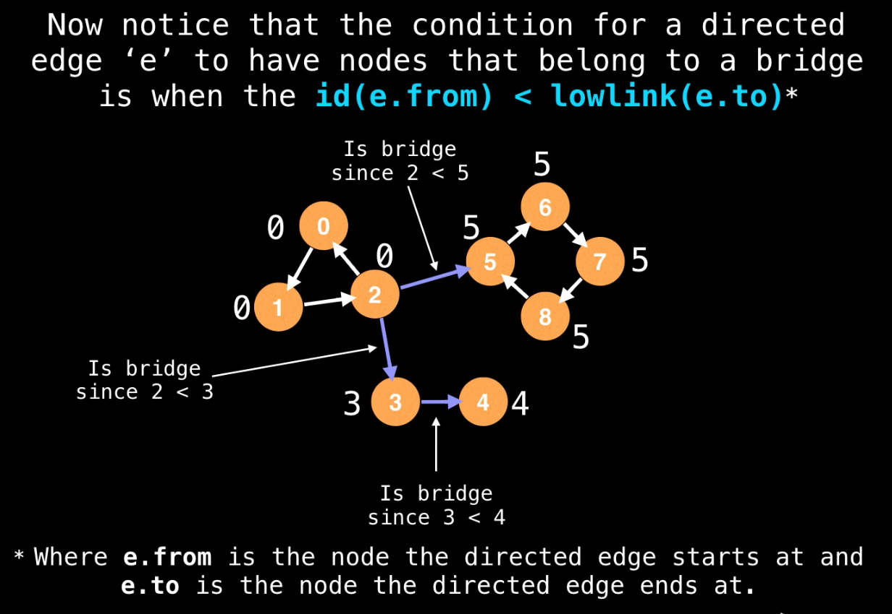

# Critical Connections in a Network

_update Oct 31, 2019_

[LeetCode](https://leetcode.com/problems/critical-connections-in-a-network/)

There are n servers numbered from 0 to n-1 connected by undirected server-to-server connections forming a network where connections\[i\] = \[a, b\] represents a connection between servers a and b. Any server can reach any other server directly or indirectly through the network.

A critical connection is a connection that, if removed, will make some server unable to reach some other server.

Return all critical connections in the network in any order.

**Example1:**

```text
        1 ---- 2
        |    /
        |   /
        |  /
         3
         |
         |
         0

Input: n = 4, connections = [[0,1],[1,2],[2,0],[1,3]]
Output: [[1,3]]
Explanation: [[3,1]] is also accepted.
```

**Constraints:**

```text
1. 1 <= n <= 10^5
2. n-1 <= connections.length <= 10^5
3. connections[i][0] != connections[i][1]
4. There are no repeated connections.
```

## Basic Idea:

先贴一个youtube链接：[Bridge Algorithm](https://www.youtube.com/watch?v=aZXi1unBdJA&t=134s)

这道题目实际上需要应用一个网络中常用的算法：Bridge Algorithm，用以在一个无向图中寻找所有的critical connection，所谓 critical connection 是指当移除该 edge 的时候会增加图中的联通块数量。

算法的基本思路是对于联通无向图，从任意一点出发做DFS，在DFS的过程中，给每个 visited vertex 依次 label 从小到大的 id 值，并且沿途更新每个 vertex 的 lowLink value。（一个 vertex 的 lowLink value 是指它在DFS中下游遇到节点的最小 label id）。而判断一条边`e(u,v)`是不是 critical edge，就只要判断 `ids[u] < lowLink[v]`，这样就说明 `e(u,v)` 是一个 critical edge。

### 举例说明



如上图所示，我们从左边的 0 开始 dfs，在到达2时无论是走向0还是走向5或者3，在dfs返回之后，5的lowLink value一定小于 2 的 id，3也一样，还有4. 这样一定能找到三条 critical edges。

## Java Code:

```java
class Solution {
    private List<List<Integer>> graph;
    private List<List<Integer>> res;
    private int[] lowLinks;
    private boolean[] visited;
    private int[] ids;
    private int nextId = 0;
    private int N;

    public List<List<Integer>> criticalConnections(int n, List<List<Integer>> connections) {
        res = new ArrayList<>();
        N = n;
        graph = initGraph(connections);
        visited = new boolean[N];
        lowLinks = new int[N];
        ids = new int[N];
        Arrays.fill(lowLinks, Integer.MAX_VALUE);
        Arrays.fill(ids, -1);

        dfs(0, -1);
        return res;
    }

    private void dfs(int start, int parent) {
        visited[start] = true;
        ids[start] = nextId++;
        lowLinks[start] = ids[start];
        for (int neighbor : graph.get(start)) {
            if (neighbor == parent) continue; // skip back edge
            if (visited[neighbor]) {
                lowLinks[start] = Math.min(lowLinks[start], ids[neighbor]);
            } else {
                dfs(neighbor, start);
                lowLinks[start] = Math.min(lowLinks[start], lowLinks[neighbor]);
                if (ids[start] < lowLinks[neighbor]) {
                    res.add(Arrays.asList(start, neighbor));
                }
            }
        }
    }

    private List<List<Integer>> initGraph(List<List<Integer>> edges) {
        List<List<Integer>> ret = new ArrayList<>();
        for (int i = 0; i < N; ++i) ret.add(new ArrayList<>());
        for (List<Integer> edge : edges) {
            int u = edge.get(0), v = edge.get(1);
            ret.get(u).add(v);
            ret.get(v).add(u);
        }
        return ret;
    }
}
```

