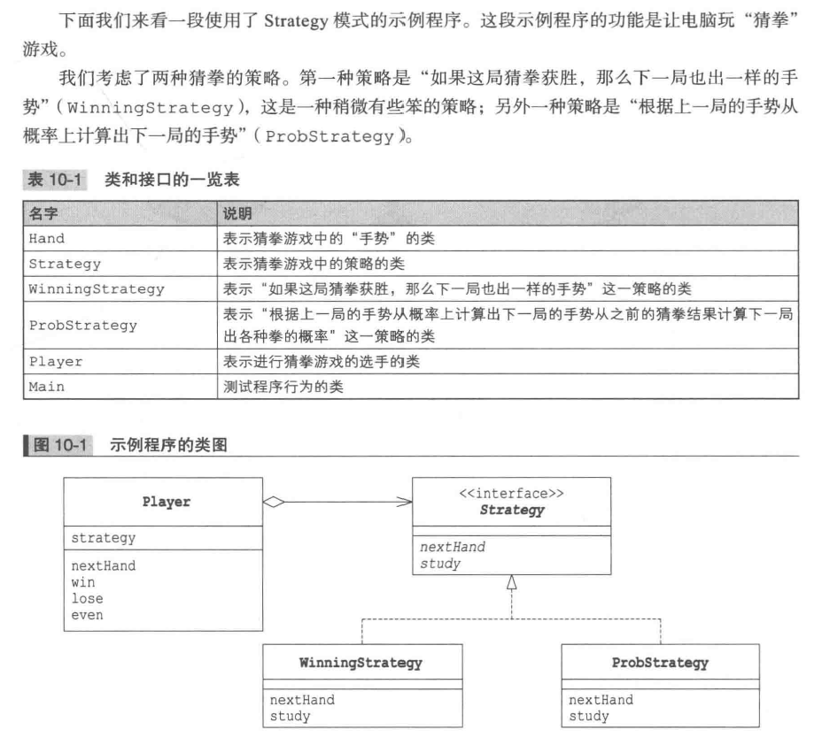
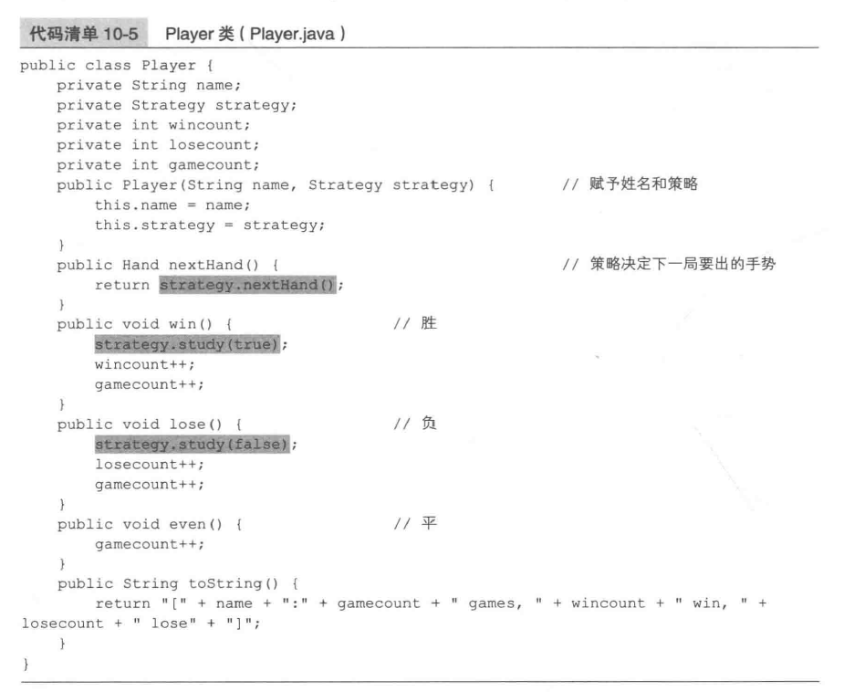

# Strategy Pattern
_update Mar 6, 2020_

---

## 1. Introduction
基本思路就是整体替换算法的实现部分，可以实现在runtime切换不同的算法。

## 2. Example

在Strategy interface中定义了该算法需要实现的两种功能，即 nextHand 和 study。而player则持有一个 Strategy 实现类的 instance，通过调用定义的两种方法来出拳。

这样，通过替换不同的实现类就可以切换不同的出招策略。

## 3. Strategy 模式中的角色
* Strategy：Strategy 接口
* ConcreteStrategy：WinningStrategy类和ProbStrategy类
* Context：负责使用strategy，由Player扮演

## 4. 拓展思路
### 1）为什么需要Strategy角色
将算法部分与其他部分分割开来，通过通用的API来定义算法接口，这样有利于替换不同的算法，而且方便测试与对比不同的算法。
### 2）运行中也可以切换策略
例如在内存较少的环境中可以使用SlowButLessMemoryStrategy, 而在内存容量较多的地方可以使用FastButMoreMemoryStrategy。同时可以同时使用两种算法先后计算，使用其中一个的结果来验证另一个的结果。

## 5. 相关设计模式
### 1） Flyweight 模式
有时候会使用Flyweight模式让多个地方共用ConcreteStrategy角色。
### 2）Abstract Factory 模式
使用Strategy可以整体替换算法，使用Abstract Factory模式则可以整体替换具体工厂，零件以及产品。
### 3）State模式
使用Strategy模式和State模式都可以替换被委托对象，而且他们的类之间关系很类似，但两种模式目的不同。Strategy模式中ConcreteStrategy可能你会被替换，但如果没有需要也可以不替换。而State模式中，每次状态的变化，被委托对象的类都必定会替换。
