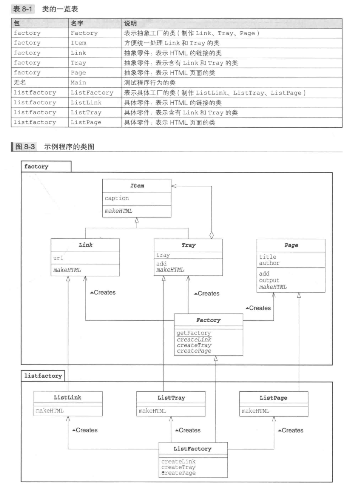
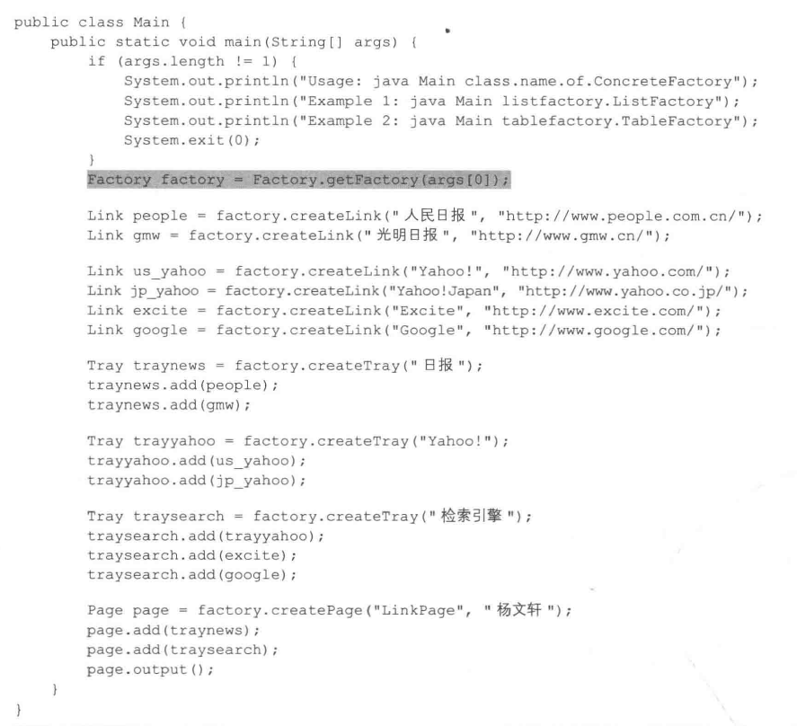
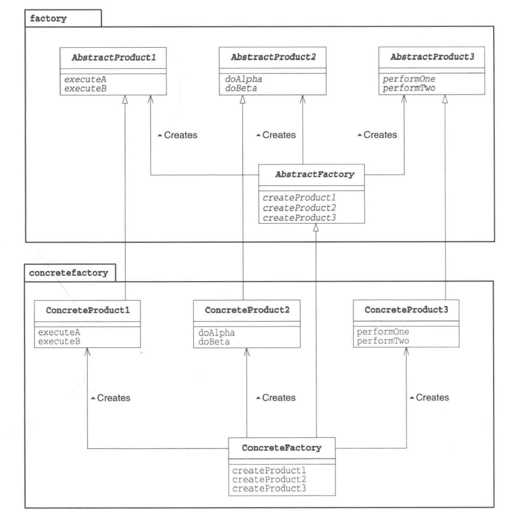

# Abstract Factory Pattern

_Oct 27, 2019_

## 1. Introduction

Abstract Factory 模式主要解决的问题是，可以在不指定具体类名的前提下，提供API来生成 “multiple families of class” 的实例。在Abstract Factory中，我们将抽象零件组装成抽象产品，不关心具体的零件和工厂实现，只关心API。

## 2. Example



这里的例子中，上面的 factory 包中是抽象产品和抽象工厂，下面的 listfactory 包中则定义了具体的工厂和产品。

具体的类 ListLink，ListTray 以及 ListPage 需要实现父类中的抽象方法：makeHTML。这个例子就是想用一个抽象工厂来通过 `getFactory()` 方法获取不同的具体工厂，再利用抽象工厂中声明的方法 `createLink, createTray, createPage` 生成不同的实例，然后调用不同具体实例中的方法，最终生成HTML页面。由于我们可以有不同的具体工厂和具体产品的实现，就可以通过替换来使用同一套API生成不同的HTML页面。

抽象 Factory 的实现：

```java
package factory;

public abstract class Factory {
    Factory factory = null;

    public static Factory getFactory(String classname) {
        try {
            factory = (Factory)Class.forName(classname).newInstance();
        } catch (ClassNotFoundException e) {
            System.err.println(classname + "Class not found");
        } catch (Exception e) {
            e.printStackTrace();
        }
        return factory;
    }
    public abstract Link createLink(String caption, String url);
    public abstract Tray createTray(String caption);
    public abstract Page createPage(String title, String author);
}
```

Main class 的实现：&#x20;



从上面的代码可以看出，我们可以通过传入类名字符串 `String classname` 的方法来获取具体的工厂实例，之后调用 abstract factory 中声明的 API 生成具体的产品。再通过使用具体产品中实现的抽象产品中的方法来实现功能。可以想象，如果我们有其他具体的实现（例如另一个具体工厂 TableFactory），就可以在不改变 main 函数（也就是调用方，client）的前提下实现不同的功能。

这里的 `getFactory()` 方法也可以有不同的设计，例如使用另一个类 `class FactoryProvider` 来提供这个方法，从而只在 abstract factory 类中声明需要的 factory 的 API signature 即可。

## 3. Abstract Factory 模式中的角色

&#x20;1\. AbstractProduct (抽象产品)



> 负责定义AbstractFactory角色所生成的抽象零件和产品的API，在示例中，由Tray,Link,Page类扮演。 2. AbstractFactory （抽象工厂） 负责定义用于生成抽象产品的API，在示例中的 Factory class 扮演这个角色。 3. Client （委托者） 负责调用 AbstractFactory 角色和 AbstractProduct 角色的API进行工作，对于具体的零件，产品和工厂一无所知。在示例中由Main扮演。 4. ConcreteProduct （具体产品） 由 ListLink, ListTray, ListPage 扮演 5. ConcreteFactory （具体工厂） 由 ListFactory 扮演

## 4. 拓展思路

### i. 易于增加具体的工厂

根据已经规定好的 abstract factory 和 abstract product 的API，我们可以轻易地编写更多的具体工厂和具体产品。

### ii. 难以增加新的零件

如果需要增加新的零件，即增加生成抽象产品所需要的其他零件以及步骤，我们就可能需要对所有的具体工厂进行相应的修改。例如上面例子中，如果我们要加入Picture零件，我们就需要在 ListFactory 中加入 createPicture 方法，并且新增 ListPicture 类。（这里的零件指的是上面的Link和Tray，而产品指的是Page）。

## 5. 相关设计模式

1.  Builder Pattern

    > Abstract Factory 模式通过调用抽象产品的API来组装抽象产品，生成具有复杂结构的实例；Builder 模式则是分阶段制作复杂实例。
2.  Factory Method Pattern

    > 有时 Abstract Factory 模式中零件和产品的生成会使用到 Factory Method 模式
3.  Composite Pattern

    > 有时 Abstract Factory 模式在制作产品的时候会使用 Composite 模式
4.  Singleton Pattern

    > 有时 Abstract Factory 模式中的具体工厂会使用到 Singleton 模式

## 6. 延伸：各种生成实例的方法

1.  new

    > 使用 new 关键字生成，需要类名出现在代码中
2.  clone

    > 如在 Prototype 模式中的 clone 方法，可以根据现有实例来复制新的实例
3.  newInstance

    > ~~可以通过调用 `java.lang.Class` 类的 newInstance 方法可以通过 Class 类的实例生成出Class所表示的实例（会调用无参构造函数），例如 `someobj.getClass().newInstance()`。但是要注意这个函数会抛出InstantiationException异常或者IllegalAccessException异常，需要try catch。~~ Java 9 中 newInstance 方法已经被 deprecated，推荐使用的是 Class 类的 `getDeclaredConstructor().newInstance()` 方法.
