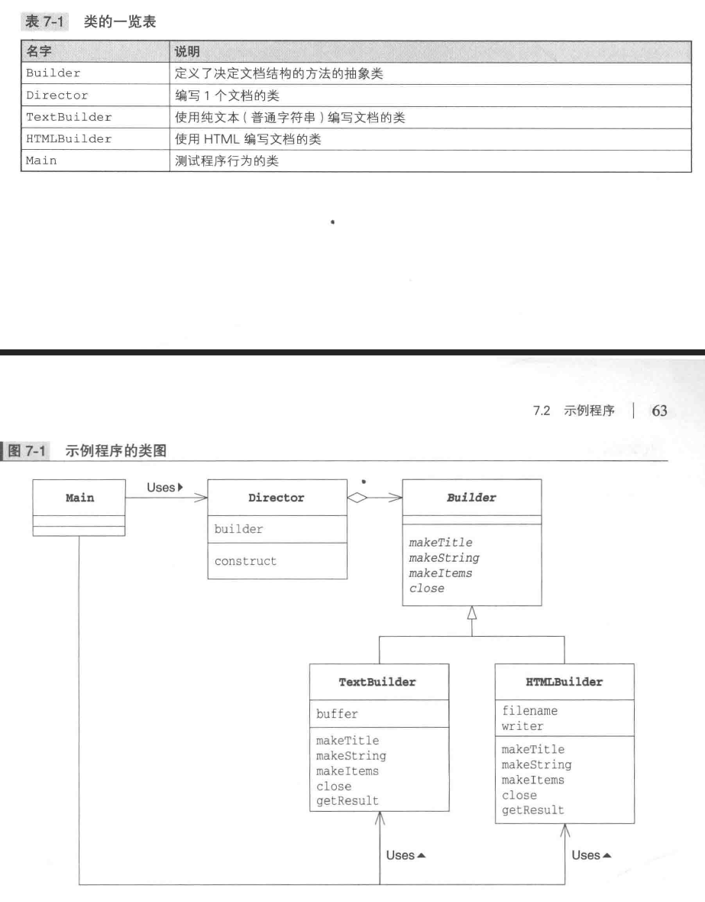
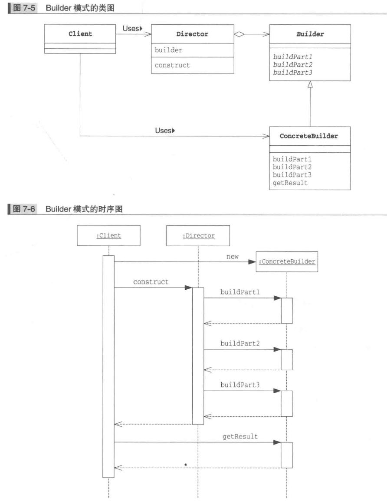

# Builder Pattern
_update Oct 26, 2019_

---
## 1. Introduction
当我们需要创建的实例结构过于复杂，步骤繁多的时候，我们可以使用Builder模式。

## 2. Example

这里 Director 负责调用 Builder 的各种方法设置所需要的各种属性，完成不同阶段的文档构造，最后调用close方法完成文档的build。而 Director class 并不需要知道传入的具体 builder 的类型，因为它只会调用 Builder class 声明的共有的方法。

## 3. Builder Pattern 中的角色
1. Builder （建造者）
  > 由Builder class担任，准备了用于生成实例的方法。
2. ConcreteBuilder （具体建造者）
  > 负责实现Builder角色接口的类，定义了生成实例实际被调用的方法，还定义了获取最终生成结果的方法。
3. Director （监工）
  > 负责调用Builder接口的API生成实例，并不依赖于 ConcreteBuilder 角色。

## 4. 相关设计模式
1. Template Method Pattern
  > 在Builder模式中，Director控制Builder；在Template Method中，父类控制子类。这里的控制指的是方法调用顺序的控制。
2. Composite Pattern
  > 有些情况下Builder模式生成的实例构成了 Composite 模式。
3. Abstract Factory Pattern
  > Builder 模式和 Abstract Factory 模式都用于生成复杂的实例。
4. Facade Pattern
  > 在Builder模式中，Director角色通过组合Builder角色中的复杂方法可以向外部提供可以简单生成实例的API（例子中的construct）；Facade 模式中的 Facade 角色则是通过组合内部模块向外部提供可以简单调用的API；

## 5. Builder Pattern 的好处
1. 当构造步骤非常多的时候，可以使用builder实现分步骤的build操作，而且可以让set方法返回该build实例，从而实现链式操作。相反，如果直接使用new constructor，可能会需要传入非常多的参数，抑或是需要在创建实例之后 call 多次 setxxx 方法，也增加了代码可读性。
2. 在builder尚未完成build工作的时候并不会生成被build类的实例，也就避免了先创建实例再调用 setxxx 方法所潜在的很多问题。
3. 可以存在 `toBuilder()` 方法来将实例转化为builder，从而更方便地以某个实例当前状态为基础继续构建新的实例。
4. 和 Factory Pattern 对比，Builder Pattern 无需 Director 知悉具体的可以被build的类名，而Factory Pattern 至少需要有一个可以生成实例的 class 的列表。于是 Builder Pattern 有了更好的独立性。
