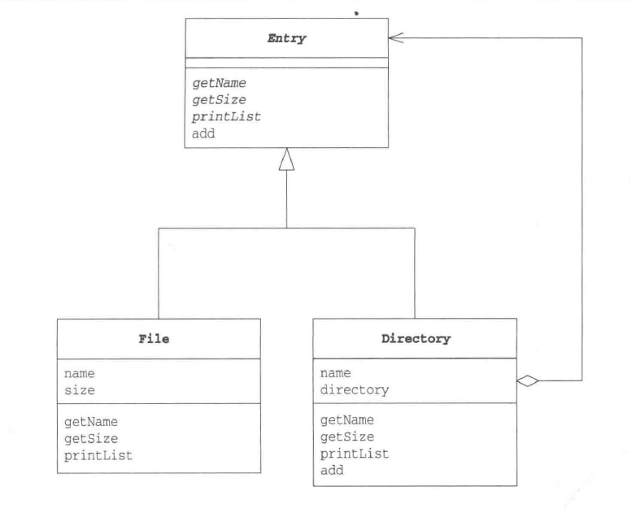

# Composite Pattern
_update Mar 9, 2020_

---
# 1. Introduction
Composite 模式就是用来构造容器和内容可以被一视同仁的递归结构，例如在文件系统中，文件夹和文件在某种情况下就可以被一视同仁（inode），在文件夹中既可以放入文件夹，也可以放入文件，而一些操作例如 `ls` 既可以对目录执行也可以对文件执行。

# 2. Example

Entry类为目录和文件对父类，定义了一些公有的接口。File类和Directory则继承公有类，并分别实现接口。

```java
public abstract class Entry {
    public abstract String getName();
    public abstract int getSize();
    public Entry add(Entry entry) throws FileTreatmentException {
        throw new FileTreatMentException; //如果子类不实现，则会是这样的默认执行
    }
    public void printList() {
        printList("");
    }
    protected abstract void printList(String prefix);
    public String toString() {
        return getName() + " (" + getSize() + ") ";
    }

}

public class File extends Entry {
    private String name;
    private int size;
    public File(String name, int size) {
        this.name = name;
        this.size = size;
    }
    public String getName() {
        return name;
    }
    public int getSize() {
        return size;
    }
    protected void printList(String prefix) {
        System.out.println(prefix + "/" + this);
    }
}

public class Directory extends Entry {
    private String name;
    private ArrayList directory = new ArrayList();
    public Directory(String name) {
        this.name = name;
    }
    public String getName() {
        return name;
    }
    public int getSize() {
        int size = 0;
        Iterator it = directory.iterator();
        while (it.hasNext()) {
            Entry entry = directory.iterator();
            while (it.hasNext()) {
                Entry entry = (Entry) it.next();
                size += entry.getSize();
            }
        }
        return size;
    }
    public Entry add(Entry entry) {
        directory.add(entry);
        return this;
    }
    protected void printList(String prefix) {
        System.out.println(prefix + "/" + this);
        Iterator it = directory.iterator();
        while (it.hasNext()) {
            Entry entry = (Entry) it.next();
            entry.printList(prefix + "/" + name);
        }
    }
}
```
当我们在外面调用 Entry 类型的 object 的各种方法时，不需要知道它到底是file还是dir，这体现了容器与内容的一致性。


## 3. Composite 模式中的角色
**1） Leaf**

表示内容，在其中不能放入其他对象，由File扮演

**2） Composite**

表示容器，其中既可以放入Leaf也可以放入其他Composite，由Directory扮演

**3） Component**

使得Leaf和Composite具有一致性，是两者的父类，由Entry扮演

**4） Client**

使用Composite模式的角色


## 4. 拓展思路
### 1）多个和单个的一致性
将composite和leaf当作同类处理，对于comnposite来说，则可以将多个child的对象结合在一起，当作同一个对象处理。

### 2）Add等操作child的方法应该放在哪里
#### 1. 定义在Entry类中，报错
例如这里的例子，只在Directory中override add方法，调用File类的add方法则会抛出异常
#### 2. 定义在Entry类中，什么都不做
#### 3. 声明在Entry类中，但不实现
这样做的话所有子类都必须根据各自需求实现相应方法
#### 4. 只定义在Directory类中
这样做的话当需要做add/remove操作的时候，需要对每个Entry object做cast

## 5. 相关设计模式
**Command模式**

使用Command模式写宏命令的时候使用了Composite模式

**Visitor模式**

可以使用Visitor模式访问Composite模式中的递归结构

**Decorator模式**

Composite模式通过Component角色使容器和内容有一致性。而Decorator使Wrapper和Wrappee有一致性。
