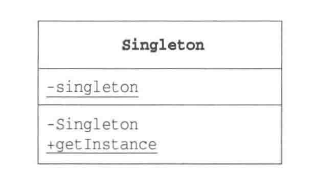

# Singleton Pattern

_update Oct 25, 2019_

## 1. Introduction

当我们想在程序中表示某个东西只会存在一个时，就会有“只能创建一个实例”的需要。而我们不能只通过约定禁止用户调用 `new MyClass()` 来创建更多 instance，同时，我们要在程序上也表示出“只存在一个instance”，这就需要使用 Singleton Pattern。



注意上面的UML中，下划线表示该 field 或者 method 为 static。前面的 `-` 表示private，`+` 则表示public。其中上面的 `-singleton (下划线)` 为一个 singleton field，下面的则分别表示 private 的构造函数 `Singleton()` 以及 `public static Singleton getInstance()`。

Singleton 类的**构造函数是Private**的，这是为了禁止从 Singleton class 外部调用。Singleton Pattern 需要保证在任何情况下都智能生成一个实例，为了达到这个目的，必须设置构造函数为“Private”。

### Sample Code

```java
public class Singleton {
    private static Singleton singleton = new Singleton();
    private Singleton() {
        System.out.println("private constructor called");
    }
    public static Singleton getInstance() {
        return singleton;
    }
}
```

调用如上code获得 Singleton class 实例，每次都会获得同样都一个实例。

## 2. 思路拓展

### i. 为什么一定要设置限制

对于有些class，如果允许多个instance同时存在可能会产生意想不到的Bug，如果只有一个实例，就可以在这个前提下放心编程了。而 Singleton 模式可以禁止在外部调用 Singleton Class 的构造函数，从而避免不必要的Bug。

### ii. 何时生成这个唯一的实例

上面例子中的是 ”饿汉模式“，即 singleton instance 会在类加载的时候被创建。另外我们也可以使用 “饱汉（懒汉）模式”，在 `getInstance()` 中先检查 instance 是否已经被创建，如果没有，再创建该instance。这样可以减少不必要的实例创建，加速类的加载时间，减少不必要内存空间占用。但同时需要注意线程安全，可能需要使用 synchronized 同步 getInstance。另外为了达到线程安全，还可以使用静态内部类来hold instance，这样可以由 JVM 来保证线程安全：

具体地关于静态内部类来实现 Singleton 可以查看 [这篇文章](https://blog.csdn.net/mnb65482/article/details/80458571).

```java
    public class SingleTon{
        private SingleTon(){}

        private static class SingleTonHoler{
            private static SingleTon INSTANCE = new SingleTon();
        }

        public static SingleTon getInstance(){
            return SingleTonHoler.INSTANCE;
        }
    }
```

## 3. 相关设计模式

在以下模式中，多数情况下只会生成一个实例：

1. AbstractFactory Pattern
2. Builder Pattern
3. Facade Pattern
4. Protorype Pattern

