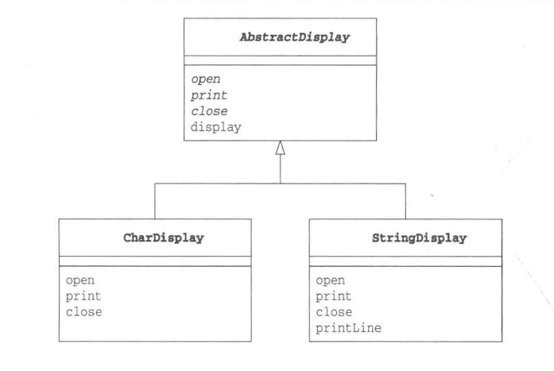

# Template Method 模式
_update Oct 21, 2019_

---
## 1. 介绍
在父类中定义处理流程的框架，在子类中实现具体处理的模式就称为 Template Method 模式。

### 举例

CharDisplay 和 StringDisplay 分别继承 AbstractDisplay 父类，实现了其中的open, print, close方法。而父类的display方法中调用了 open, print, close，这就是处理流程的实现，在父类中提供这个实现之后就无须在每个子类中提供。这里，父类中的 `display` 方法，就是所谓的 "template method"。

## 2. 思路拓展
### i. 使逻辑处理通用化
当我们在父类中定义了方法实现之后就无需在每个子类中定义重复实现（copy paste），当我们发现bug的时候，也只需要修改父类中的一处即可。

### ii. 父类与子类的协作
父类与子类是共同工作的，在子类中实现父类中声明的抽象方法时，必须要理解这些抽象方法被调用的时机（即理解父类中所实现的方法，之后再实现父类中声明的抽象方法）。

### iii. 父类与子类的一致性
使用 Abstract Class 也就是父类的类型来保存子类变量，这样即使没有用instanceof指定子类的类型也可以调用父类方法。

## 3. 相关设计模式
1. Factory Method 模式
> Factory Method 模式是将 Template Method 模式用于生成实例的一个典型例子。
2. Strategy 模式
> 在 Template Method 模式中，我们**使用继承来改变程序的行为（不同子类）**，而在 Strategy 模式中，**使用委托改变程序行为**。与 Template Method 模式中改变部分程序行为不同，Strategy 模式用于替换整个算法。

## 3. 延伸: 类的层次与抽象
