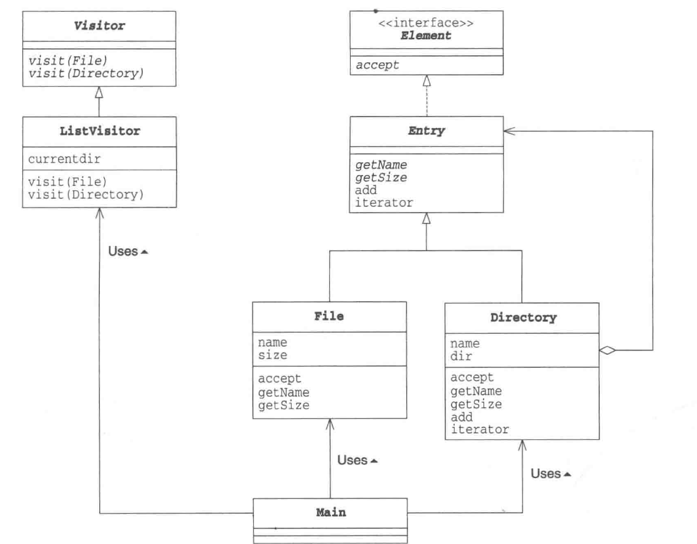

# Visitor Pattern

_update Mar 21, 2020_

## 1. Instruction

Visitor模式的目的是将**数据结构**和**处理方法**分离开来，这样当我们需要增加对数据结构对操作时就只需要编写新的访问者，然后让数据结构接受新的访问者。

## 2. Example



```java
// Visitor的base class，根据每个具体的element声明visit方法，稍后被element在accept中调用
public abstract class Visitor {
    public abstract void visit(File file);
    public abstract void visit(Directory directory);
}

public interface Element {
    public abstract void accept(Visitor v);
}

public abstract Entry implements Element {
    public abstract String getName();
    public abstract int getSize();
    public Iterator iteraotr();
    public String toString();
}

// 在Element子类Directory和File中的accept的实现都是这样：
// 这样做之后，就可以call到visitor中针对这个具体类的object “this” 的visit 方法
    public void accept(Visitor v) {
        v.visit(this);
    }

public class ListVisitor extend Visitor {
    private String currentDir = "";
    public void visit(File file) {
        System.out.println(currentDir + "/" + file);
    }
    public void visit(Directory directory) {
        System.out.println(currentDir + "/" + directory);
        String savedDir = currentDir;
        currentDir += "/" + directory.getName();
        Iterator it = directory.iterator();
        while (it.hasNext()) {
            Entry entry = (Entry) it.next(); // up cast, no overhead
            entry.accept(this); // 会递归调用visit
        }
        currentDir = savedDir; // backtrack
    }
}
```

事实上在Visitor Pattern中对于数据结构的访问是由数据结构的类来主导的，在上面的例子中，对于数据结构操作的入口其实是 `Element.accept(Visitor v)`，而调用这个方法只是为了在 `Visitor.visit(Element e)` 中传入具体的 Element 的 subclass 的 instance，由此调用正确的对应这个具体类的visit方法，并且避免主动的type checking 以及 casting。

## 3. Visitor Pattern 中的角色

* **1. Visitor**

  负责对数据结构中每个具体角色（ConcreteElement T）声明一个`visit(T)`方法

* **2. ConcreteVisitor**

  负责实现Visitor角色所定义的API，对于每个ConcreteElement的具体操作在visit方法中实现，在其中可以存储状态，随着visit处理的进行，其中的状态可以发生变化，就像上面例子中的currentDir。

* **3. Element**

  表示Visitor访问的对象，声明了accept方法，接受参数为Visitor。

* **4. ConcreteElement**

  实现了具体的accept方法，call visit方法，并将自身的指针传入。

* **5. ObjectStructure**

  负责处理Element的集合，在例子中由Directory扮演。具体的，例如当我们iterate一个directory下的所有File和次级Directory时，我们需要递归调用子结构的accept方法。

## 4. 思考

感觉在之前学习过的设计模式中Vistor Pattern是属于相对令人费解的，我觉得在复习的时候需要注意如下几点：

* **1. 避免type checking and casting**

  考虑到数据结构类会有hierarchy，那么在处理的时候如果拿到的只是Base Class类型的引用，我们免不了需要在**处理方法**的类中检查类型以及cast，因为这样会影响性能并且引入更多的强耦合。而Visitor Pattern则可以避免这样的问题，因为通过在Visitor class中为每个具体的数据结构的类declare不同的visit方法，而在每个具体data structure的类中实现accept方法，将自身this指针pass到visitor的visit方法，通过这种方法，就可以利用overload调用到正确的visit方法，而不需要任何的type check and cast。

* **2. Double Dispatch（双重分发）**

  Double Dispatch是runtime指对于调用方法的选择同时基于 receiver type and argument type 两个因素。而在Java中，寻常的基于Interface类型的具体instance的方法调用和普通的method overload都只是single dispatch。当我们有同一个Interface的不同subclass 的instance时，在调用该Inteface中的方法时，会自动根据instance的具体类中的不同实现调用不同的方法，这也就是普通的polymorphism。而method overload虽然可以根据不同的argument type选择不同的method，但这里的argument type只是基于compile time的信息，即只要在调用这个方法时候parameter的type是base class或者interface的，那么不管传入的是哪个具体的class，overload 机制都无法区分具体的argument的type。   
  
   而在Visitor Pattern中，首先我们通过不同的ConcreteVisitor实现第一重分发，然后因为visit方法是在每个ConcreteElement中的accept方法中调用，于是被传入的参数直接就是具体的ConcreteElement的类型，于是这里实现了第二重分发。最终的结果就是我们无需知道具体的ConcreteVisitor和ConcreteElement的类型即可调用到正确的visit方法。同时需要注意，这也是为什么虽然accept方法具有完全一样的实现却不能在Element base class中实现的原因，因为如果这样做，传入`visit`方法的`this`指针类型就变成了Element base class类。

  ```java
    element.accept(visitor);
    visitor.visit(element);
  ```

  这样的调用构成了双重分发，即ConcreteElement和ConcreteVisitor这两个具体的类的instance共同决定了实际进行的处理。

* **3. 体现了Open/Closed Principle**

  Visitor模式将数据结构本身和对其进行处理两类逻辑分离开来，当我们想要拓展新的操作的时候，只需要增加新的visitor，而不需要改动已有的Element以及ConcreteElement。

* **4. 易于增加ConcreteVisitor角色，难以增加ConcreteElement角色**

  当我们想要增加visitor的时候，不需要修改已有的Element。但是当我们想要增加新的Element的时候，就需要修改visitor，为新增加的ConcreteElement添加新的visit方法，并且要在Visitor的所有子类中实现这个方法。

* **5. 使用Visitor模式需要的条件**

  如果要使用visitor pattern，Element角色必须向Visitor角色公开足够多的信息，例如上面例子中，Directory类必须提供可以获得每个目录的iterator方法，以及各种获取name，获取size的方法。同时这样做的缺点是如果公开了过于多的信息，甚至是不应当被公开的信息，后期对数据结构改良就会变的非常困难。

## 5. 相关设计模式

* **Iterator**

  两者都用于对数据结构进行处理，而Iterator只是用于遍历，Visitor则对于保存在数据结构中的元素进行某种特殊处理

* **Composite**

  有时访问者所访问的数据结构会使用Composite模式

* **Interpreter**

  在Interpreter Pattern中有时会使用Visitor模式，生成语法树后，可能会用Visitor模式对各个节点进行处理

