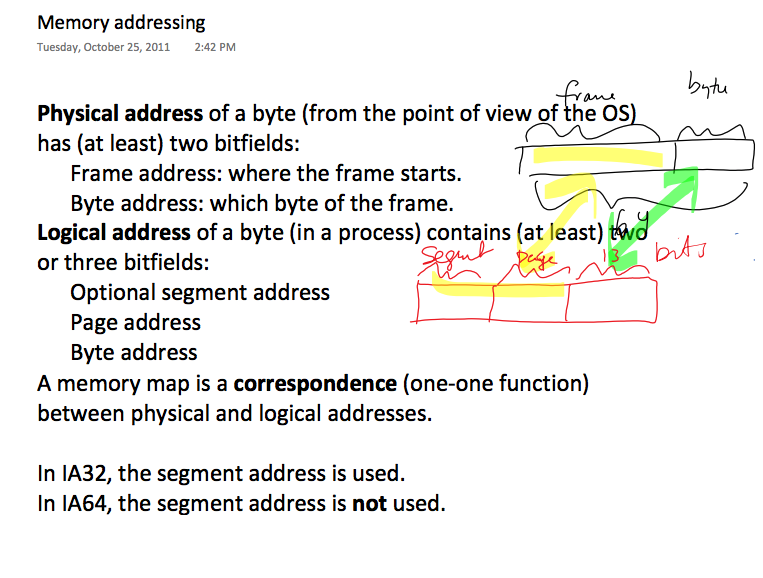

# Virtual Memory

_update 2017-11-15 11:00:15_

## Memory fragmentation:

只有一部分 heap is “used”。process中每个内存块都需要比实际数据大，没有利用到的内部的空间叫做 "internal fragmentation"。process 之间的在 global memory map 中没利用到的空间叫做 external fragmentation。

Fragmentation 可以由于 fixed page size, buddy system, 和 reclamation（process exit，heap 释放，留下fragment） 造成。我们没有办法 eliminate fragments，因为我们不知道 pointers 在哪里。

**造成 Fragmentation 的原因有三点：**

1. Fixed page size： program的size不是 page size 的整数倍，所以会留下剩余，这是 internal fragmentation；
2. Buddy system： 分配的空间是 power of two pages，这是 internal fragmentation；
3. Reclaimation： 程序退出会释放内存，在 physical frame 中留下 holes，造成 external fragmentation；

## Memory mapping:

* A frame is a unit of memory in the OS;
* A page is a unit of memory  in the process;
* Memory mapping associates \(os\) frames with \(process\) pages;
* The OS has to maintain data on what gets mapped where;
* What frame goes with what process/page?
* Special handling instructions for pages: read-only,shared, private,...

  

  

  

  

## Virtual memory:

* Process run 的时候只有一部分 pages resident；
* 如果一个page is needed and isn't resident:
  1. block the process
  2. swap in the required page
  3. unblock the process after the page is resident\(it returns to the run queue\)

如果map时，有 unused frame，则将需要的contents从disk中读到这里，然后map到process page。否则，就将一个已经使用的frame unmap，按需要将其存入disk，然后用这个frame存新的。

**The dirty bit:** 如果memory page 和 disk 中不同，则需要 flush to disk before reuse。 

**LRU：**  
Optimal if memory access is linear, and increasing;

**LFU:**  
Optimal for loops;

## 题点

1. Why is it practical to relocate a frame to another physical address?

   > A frame gets mapped to a page. Its physical address can thus be moved and the logical address stays the same. In fact, this always happens when the page is recovered from disk;

2. Why is it impractical to relocate a heap page to another address?

   > 因为我们不知道有哪些指针正指向他们。

3. 保持很多休眠processes会不会 slow down the OS？

   > 只有一点慢。因为 process 的 pages 都已经 swapped out，而且 processes 都不在 run queue 中了。内存中只剩下 **process page tables**，会拖慢一点点。

